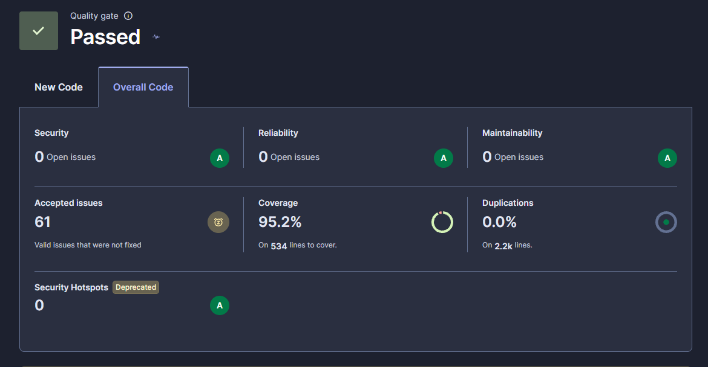
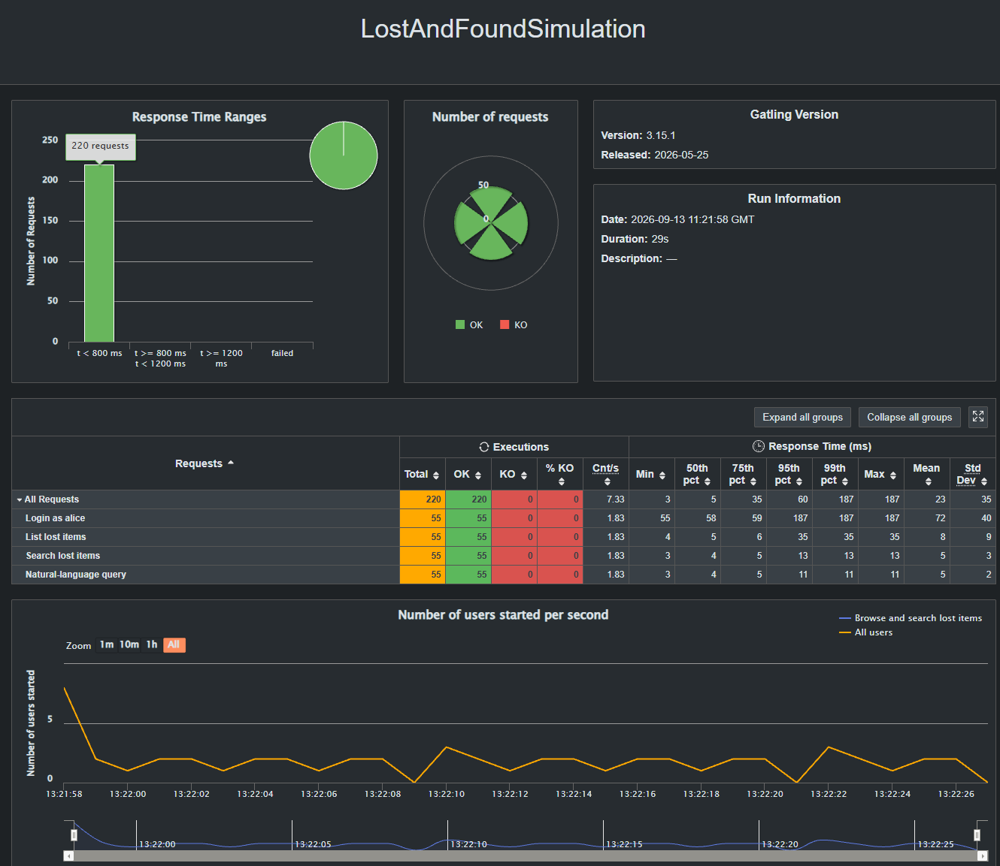
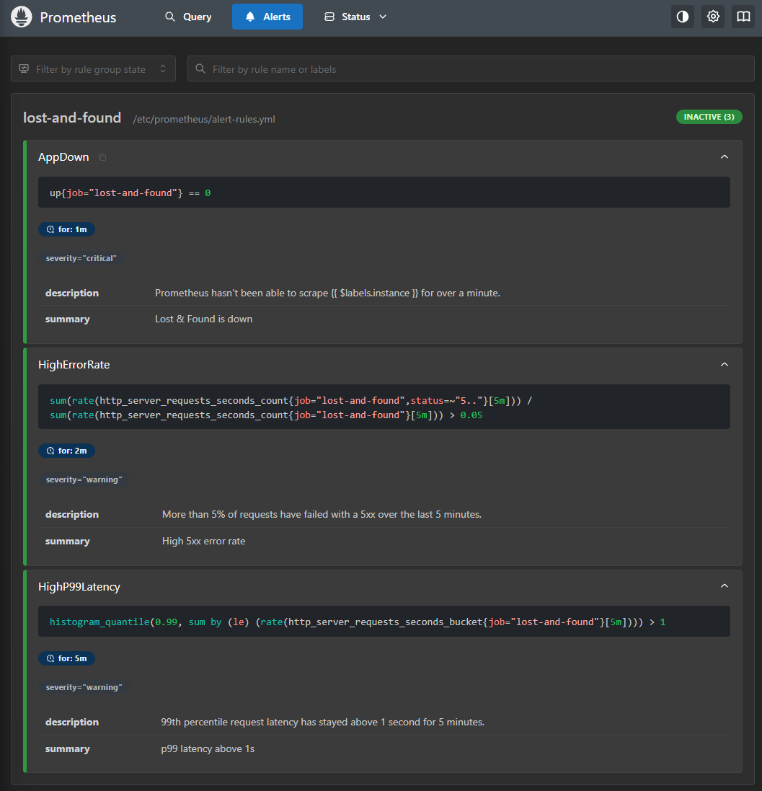
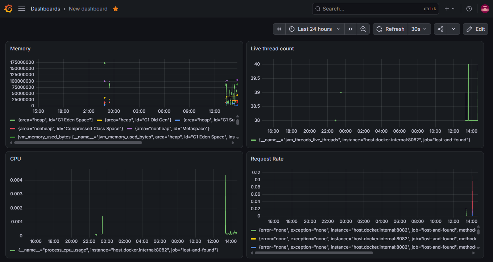
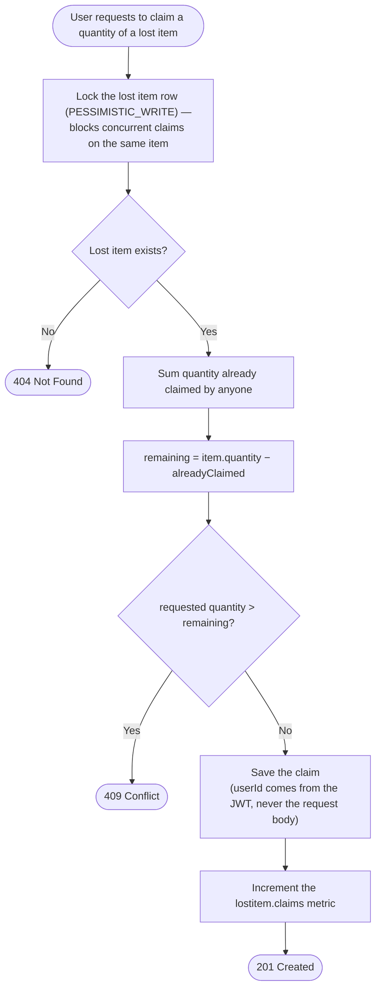
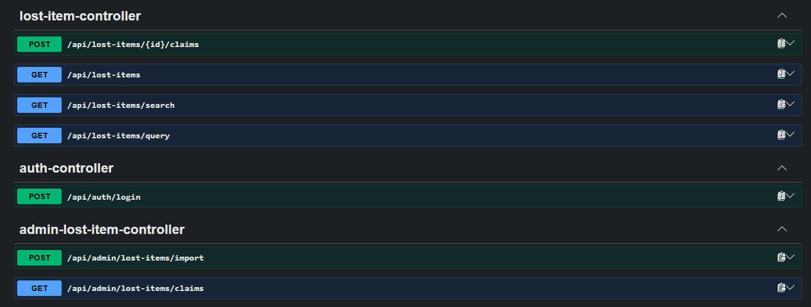

# Lost & Found

A Spring Boot service where an admin uploads a file of lost items, users
browse and claim them (partial quantities, multiple claimants per item), and
admins can review who claimed what.

## Running it

```bash
./mvnw spring-boot:run
```

The app starts on `http://localhost:8081`. It uses an in-memory H2 database
(reset on every restart) — it's private to that JVM, so there's no live
external client to point at it (no bundled H2 web console either, on
purpose — keeps the dependency footprint minimal).

Interactive API docs (Swagger UI) are at `http://localhost:8081/swagger-ui.html`
— no login needed to view them, only to call the endpoints themselves.

```bash
./mvnw test              # unit tests
./mvnw verify             # unit + integration tests, plus static analysis (see below)
```

## Static analysis

`./mvnw verify` also runs SpotBugs and PMD, and fails the build on real
findings — both are wired into the `verify` phase, so they run every time
CI (or you) runs the full check. The ruleset lives in `pmd-ruleset.xml`.

SonarQube is also wired in (`sonar-maven-plugin`), but not bound to any
build phase, since it needs a running server this project doesn't assume
anyone has. Run it against a local instance:

```bash
docker run -d --name sonarqube -p 9000:9000 sonarqube:community
./mvnw clean verify sonar:sonar "-Dsonar.host.url=http://localhost:9000" "-Dsonar.token=<token>"
```

Run `verify` first (in the same command, as above) so JaCoCo's report already
exists on disk — otherwise Sonar reports 0% coverage. On Windows, quote each
`-D` flag as shown; without quotes, `cmd.exe` can mis-split the URL.



The 61 "accepted issues" are deliberate, documented calls, not hidden
findings — things like this project's own Mockito style, or a couple of
already-justified PMD/SpotBugs trade-offs Sonar flags independently (see
`SecurityConfig`'s CSRF comment, for one).

`./mvnw test` also runs an ArchUnit check (`ArchitectureTest`) that enforces
the layering by hand instead of by convention: the domain layer can't depend
on the web layer, and controllers can't reach a repository directly — they
have to go through a domain service.

## Dependency scanning

`./mvnw org.owasp:dependency-check-maven:13.0.0:check` scans every
dependency against the NVD vulnerability database and fails the build on
anything CVSS 9+. It's not bound to `verify` since the first run downloads
the whole NVD database, which is slow. You'll need a free NVD API key
(https://nvd.nist.gov/developers/request-an-api-key) in an `NVD_API_KEY`
environment variable — never commit it, the `pom.xml` only references the
variable name.

## Load testing

Gatling isn't bound to the build either — it's just an HTTP client, so it
needs the app already running. Start it, then run the load test against it:

```bash
./mvnw spring-boot:run
# in another terminal:
./mvnw gatling:test
```

`LostAndFoundSimulation` covers the browse path (login, list, search,
natural-language query) — the read-heavy traffic real usage is expected to
look like. It deliberately skips the claim endpoint: claims have limited
stock per item, so a repeatable load test would either run out or need a
reset step between runs. Gatling writes an HTML report under
`target/gatling/` with response time percentiles and throughput.



## Metrics

Spring Boot Actuator and Micrometer are wired in, running on their own port
(`8082`, `management.server.port`) instead of the main API's `8081`. A
collector like Prometheus can't hold a rotating login token, so this endpoint
relies on network isolation instead of app-level auth — in production
that port would be restricted to the monitoring network only, never
exposed alongside the public API. Alongside the usual HTTP/JVM metrics,
there's one custom counter, `lostitem.claims`, that counts successful
claims.

## Monitoring and alerts

`monitoring/` has a small Prometheus + Alertmanager + Grafana stack that
scrapes the app and can actually fire alerts, not just expose numbers:

```bash
./mvnw spring-boot:run
cd monitoring && docker compose up -d
```

- Prometheus (`http://localhost:9090`) reads `:8082/actuator/prometheus`
  every 15s.
- Three alert rules in `monitoring/alert-rules.yml`: the app being
  unreachable, a 5xx rate over 5%, and p99 latency over a second.

  

- Alertmanager (`http://localhost:9093`) receives firing alerts. No
  Slack/email/PagerDuty is configured for this demo — alerts just show up
  in its UI — but that's one receiver block away in
  `monitoring/alertmanager.yml`.
- Grafana (`http://localhost:3000`, `admin`/`admin`) comes with Prometheus
  already added as a data source; no dashboard is provisioned in this repo,
  since a demo project doesn't need to ship one — a quick one built from
  Explore (memory, CPU, live threads, request rate, all real numbers from
  the running app) took a couple of minutes:

  

## Running multiple instances

Running more than one instance needs two things fixed first, both handled
behind config rather than code changes:

- **A real, shared database.** H2 (the default) is in-memory and private
  to each JVM — two instances would each have their own, invisible to
  each other. A `prod` Spring profile switches to a real one:

  ```bash
  docker compose up -d          # starts Postgres, see docker-compose.yml
  SPRING_PROFILES_ACTIVE=prod ./mvnw spring-boot:run
  ```

- **A shared JWT signing key.** By default a fresh RSA key pair is
  generated on every startup, so a token issued by one instance fails on
  another. Generate one real key pair once and share it via
  `APP_JWT_PRIVATE_KEY`/`APP_JWT_PUBLIC_KEY` (base64 DER, PKCS8/X509):

  ```bash
  openssl genpkey -algorithm RSA -pkeyopt rsa_keygen_bits:2048 -out key.pem
  openssl pkcs8 -topk8 -nocrypt -in key.pem -outform DER | base64 -w0   # -> APP_JWT_PRIVATE_KEY
  openssl pkey -in key.pem -pubout -outform DER | base64 -w0            # -> APP_JWT_PUBLIC_KEY
  ```

### Kubernetes

`k8s/` has manifests for exactly this: a `ConfigMap` for non-secret
config, a `Secret` for the DB password and JWT keys (never commit a real
one — copy `k8s/secret.example.yaml` to `k8s/secret.yaml`, gitignored,
and fill in real values), a single-replica Postgres `Deployment` with a
`PersistentVolumeClaim`, and the app itself at 3 replicas behind a
`Service`, with `/actuator/health/liveness` and `/actuator/health/readiness`
probes on the management port.

```bash
docker build -t lost-and-found:latest .
kubectl apply -f k8s/configmap.yaml -f k8s/secret.yaml -f k8s/postgres.yaml -f k8s/app.yaml
```

If your cluster is single-node and shares the host's Docker image cache
(older Docker Desktop Kubernetes), that's all you need — `app.yaml`'s
`imagePullPolicy: Never` will find the image already there. A multi-node
local cluster (newer Docker Desktop Kubernetes, `kind`, etc.) can't see
locally-built images on its worker nodes, so it needs a registry reachable
from inside the cluster:

```bash
docker run -d -p 5000:5000 --restart=always --name registry registry:2
docker tag lost-and-found:latest <registry-host>:5000/lost-and-found:latest
docker push <registry-host>:5000/lost-and-found:latest
```

Update `app.yaml`'s `image:` to match and set `imagePullPolicy: Always`.
`<registry-host>` is usually `host.docker.internal`, but Docker Desktop's
own image-pull proxy failed against that hostname when this was tested —
resolving it to an IP first (`getent hosts host.docker.internal` from
inside a pod) and using that IP instead worked. This is host-specific;
expect to have to work out the right value on whatever machine actually
runs this.

## Trying it out

Upload a sample file (see `sample-data/`) as an admin — either the plain-text
format from the assignment brief:

```bash
curl -X POST http://localhost:8081/api/admin/lost-items/import \
  -F "file=@sample-data/lost-items.txt"
```

or an equivalent CSV (header `ItemName,Quantity,Place`, one row per item):

```bash
curl -X POST http://localhost:8081/api/admin/lost-items/import \
  -F "file=@sample-data/lost-items.csv"
```

The endpoint picks the right parser from the file's content type or
extension. Uploading is admin-only — see **Auth** below for the token.

Log in (seed accounts: `alice`/`brian`/`carla` with role `USER`, `admin` with
role `ADMIN`, all sharing the password `password123`):

```bash
curl -X POST http://localhost:8081/api/auth/login \
  -H "Content-Type: application/json" \
  -d '{"username": "alice", "password": "password123"}'
```

List lost items as a user (any authenticated account):

```bash
curl http://localhost:8081/api/lost-items \
  -H "Authorization: Bearer <token>"
```

Search for items, typos and all (see **Search** below):

```bash
curl "http://localhost:8081/api/lost-items/search?q=labtop" \
  -H "Authorization: Bearer <token>"
```

Or ask for them in a sentence:

```bash
curl -G "http://localhost:8081/api/lost-items/query" \
  --data-urlencode "q=black bag lost near the cafeteria last week" \
  -H "Authorization: Bearer <token>"
```

Claim 2 of item `1` — who's claiming is taken from the token, not the request
body:

```bash
curl -X POST http://localhost:8081/api/lost-items/1/claims \
  -H "Authorization: Bearer <token>" \
  -H "Content-Type: application/json" \
  -d '{"quantity": 2}'
```

Admin view of every lost item and who has claimed it (needs an `admin`
token):

```bash
curl http://localhost:8081/api/admin/lost-items/claims \
  -H "Authorization: Bearer <admin token>"
```

## Auth

Login uses JWT tokens (via Spring Security's OAuth2 Resource Server
support). The app signs its own tokens — there's no outside login
provider. `POST /api/auth/login` checks your username and password, then
gives back a token that works for 1 hour. Every other endpoint needs that
token in the `Authorization` header, and admin endpoints also check that
the token says `ADMIN`.

Your account's ID is also your user ID — the same number shows up as the
claimant on a `Claim`. To turn that ID into a name for the admin report,
we use a mock service instead of a database lookup.

The key used to sign tokens is created fresh every time the app starts —
it's never saved. That's fine here, since the database also resets on
every restart, so old tokens simply stop working, like everything else.
Accounts are created automatically on startup, not through sign-up (see
`AccountSeeder`).

**Not doing:** refresh tokens, logging a token out early, logging in
through another provider, or letting people sign up themselves. All fine
for a real app, just more than this one needs.

## Search

Two search endpoints, both local — no external API calls, no signup, no
cost, works offline.

`GET /api/lost-items/search?q=` ranks items by a small hand-rolled scoring
function: exact word matches score highest, substring matches next, and
typos are tolerated via Levenshtein distance within a small threshold.
Zero-score items are dropped. For example: with the sample data loaded,
`q=labtop` (a typo) still finds both items named "Laptop" — one lost in a
`Taxi`, one at the `Airport`.

`GET /api/lost-items/query?q=` turns a sentence like "jewels lost at the
airport" into a filter: place is matched against the actual distinct
places in the database (not guessed), dates recognize a fixed set of
phrases (today/yesterday/this or last week/month, "last N days"), and
whatever words are left over are matched against the item name. Anything
it doesn't recognize is just skipped, not guessed at. That example query
strips "lost at the" as noise, recognizes `Airport` as a real place already
in the database, and matches "jewels" against the item name — so out of
the two items at the Airport (`Laptop`, `Jewels`), only `Jewels` comes
back.

## API

| Method | Path | Who | Description |
|---|---|---|---|
| POST | `/api/auth/login` | Public | Exchange a username/password for a JWT |
| POST | `/api/admin/lost-items/import` | Admin | Upload a `.txt` or `.csv` file, extract and store lost items |
| GET | `/api/lost-items` | Authenticated | List lost items, including quantity still available to claim |
| GET | `/api/lost-items/search` | Authenticated | Fuzzy/typo-tolerant search over item name and place |
| GET | `/api/lost-items/query` | Authenticated | Free-text sentence parsed into a place/date/keyword filter |
| POST | `/api/lost-items/{id}/claims` | Authenticated | Claim a quantity of a lost item (as the token's user) |
| GET | `/api/admin/lost-items/claims` | Admin | List every lost item with its claimants (userId + resolved name) |

Claiming looks like a simple write, but it's the one endpoint here with real
concurrency and security logic behind it:



The row-level lock is what makes two people claiming the last unit at the
same time safe — one succeeds, one gets a 409, never an oversell. Taking
`userId` from the JWT instead of the request body is deliberate too: an
earlier version trusted the body directly, which let anyone claim on
someone else's behalf just by changing a field.



Errors come back as `{"type": "...", "message": "..."}` with a matching HTTP
status: `404` (not found), `400` (bad request / validation), `401`
(missing/invalid token), `403` (authenticated but not allowed), `409`
(claiming more than what remains), `500` (unexpected).

## Architecture

```
domain/
  entity/      LostItem, Claim, Account - JPA entities, but framework-agnostic otherwise
  service/     business logic (claim quantity rules, import orchestration, login)
  parsing/     LostItemFileParser port (upload text -> List<LostItem>)
  search/      LostItemSearchEngine (fuzzy scoring), LostItemQueryParser (NL -> place/date/keyword filter)
  client/      UserServiceClient port (userId -> name), mocked - see data/client
  exception/   ApiException hierarchy, one type per HTTP status

data/
  repository/  LostItemRepository, ClaimRepository, AccountRepository -
               Spring Data JPA repositories, injected directly into domain.service
  client/      MockUserServiceClient - hardcoded id-to-name map, standing in
               for a real external user-info service

web/
  controller/  thin REST controllers, no business logic
  dto/         request/response records, decoupled from entities
  mapper/      assembles response DTOs (e.g. remaining-quantity calc)
  handler/     single @RestControllerAdvice mapping exceptions to responses

config/
  SecurityConfig   - JWT encoder/decoder, filter chain, error-response wiring
  AccountSeeder    - seeds demo accounts on startup (no self-registration)
```

## Known simplifications (and what production would add)

- **H2 (`ddl-auto=create-drop`) is the default database.** A `prod`
  profile is available (see "Running multiple instances") since claim
  safety already relies on a row-level lock
  (`@Lock(PESSIMISTIC_WRITE)` in `ClaimService`), and Postgres's locking
  behavior is exactly what that code assumes — but it still uses
  `ddl-auto=update` rather than real migrations. Production would go
  through Flyway or Liquibase instead of Hibernate auto-generating the
  schema.
- **No pagination** on `GET /api/lost-items` (or `/search`, `/query`) — fine
  at demo scale, would need `Pageable` for a real dataset.
- **Search is local, not AI-powered.** Fuzzy matching and query parsing
  both run in-process (Levenshtein distance, a fixed date/place
  vocabulary) — no LLM or embeddings API involved. Keeps the demo runnable
  with zero signup, config, or cost. A production version might swap in
  real NLP or a vector search for better recall.
- **`UserServiceClient` is a hardcoded mock**, not a real call to an
  external service — per the assignment brief's own instruction to write
  the least code needed since it's only a mock.

## Possible Improvements

- **Interface Segregation is a bit weaker at the repository layer** — the
  repositories extend Spring Data's `JpaRepository` directly instead of a
  smaller interface of their own, so services can technically see methods
  they never use. Deliberate trade-off to keep the project simple, not an
  oversight.
